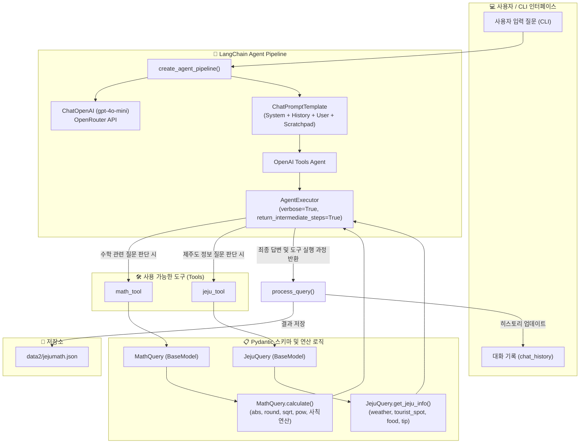
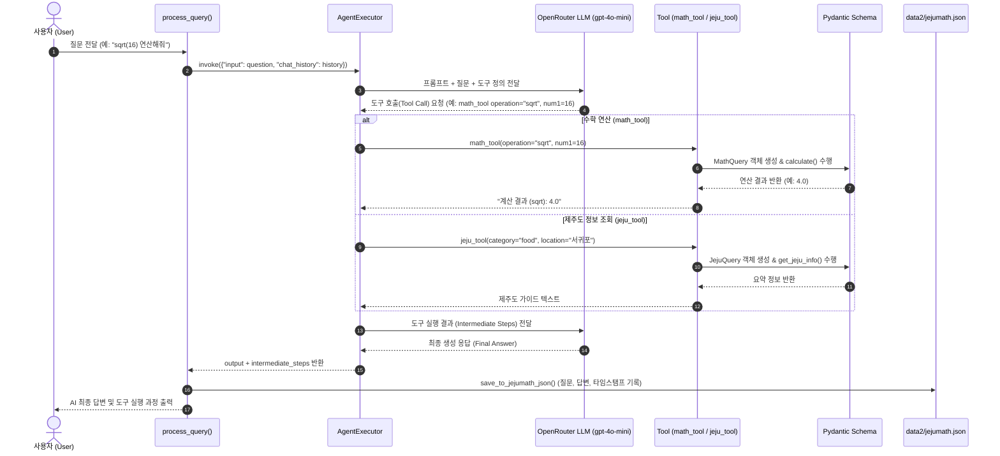
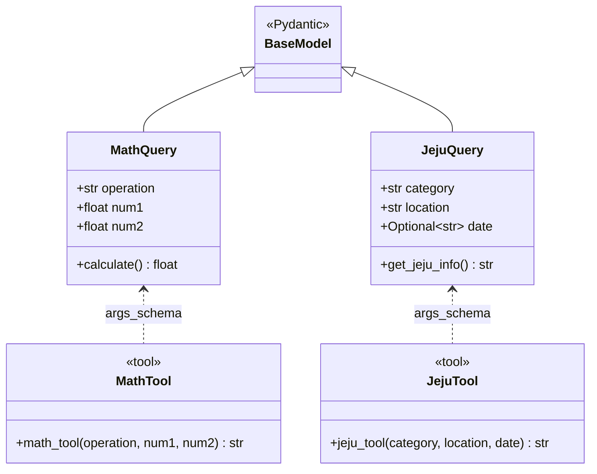

# mymathjeju.py 구조 및 실행 흐름 (Mermaid Diagram)

본 문서는 LangChain AgentExecutor 기반의 **`mymathjeju.py`** 시스템 구조, Pydantic 데이터 스키마, 도구(Tool) 호출 및 데이터 저장 흐름을 Mermaid 다이어그램으로 시각화한 문서입니다.

---

## 1. 전체 시스템 아키텍처 (System Architecture)

---

## 2. 시퀀스 다이어그램 (Sequence Diagram)

사용자 질문 처리 시 `AgentExecutor`, `LLM`, `Tools`, `JSON 저장소` 간의 개별 상호작용 흐름입니다.

---

## 3. 클래스 다이어그램 (Class Diagram)

`mymathjeju.py`에 정의된 핵심 데이터 구조 및 Pydantic BaseModel 클래스 구조입니다.

---

## 4. 데이터 흐름 요약 (Data Flow Summary)

1. **입력 수신**: CLI에서 질문과 대화 기록(`chat_history`)이 `process_query()`로 전달됩니다.
2. **에이전트 자율 판단**: `AgentExecutor`가 OpenRouter LLM을 통해 어떤 툴(`math_tool` 또는 `jeju_tool`)을 호출할지 결정합니다.
3. **스키마 검증 및 실행**: Pydantic 스키마(`MathQuery`, `JejuQuery`)로 인자를 검증한 뒤 내장 함수/수학 연산 또는 제주도 가이드 응답을 생성합니다.
4. **결과 합성 및 기록**: 에이전트 도구 실행 과정(`intermediate_steps`)과 최종 답변을 결합하여 `data2/jejumath.json`에 타임스탬프와 함께 자동 기록합니다.
